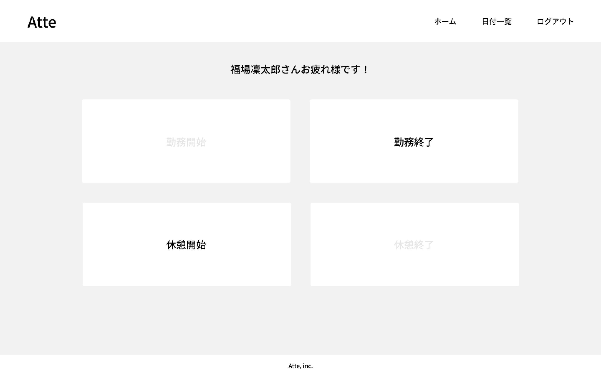

# attend
出勤、退勤、休憩時間を打刻し、ユーザー毎に日付別の実質労働時間を把握、

管理できる機能を実装したアプリケーション

## 作成した目的
全ての社員の労働時間をアプリケーションで管理し、人事評価に繋げるため

## アプリケーションのURL
https://github.com/teestojko/attend.git

## 他のリポジトリ
なし

## 機能一覧
fortifyログイン機能

出勤、退勤、休憩開始、休憩終了の打刻機能

出勤時間から休憩時間を引いた実質労働時間の検索機能

## 使用技術（実行環境）
laravel 8.83.27

php 7.4.9

html 5

css 3

## テーブル設計

## ER図

# 環境構築
git clone git@github.com:coachtech-material/

laravel-docker-template.git

mv laravel-docker-template Atte

git remote set-url origin https://github.com/teestojko/attend.git

composer require laravel/fortify

php artisan vendor:publish --provider="Laravel\Fortify\FortifyServiceProvider"

php artisan migrate

docker-compose up -d --build

composer install

touch .drawdio

php artisan vendor:publish → laravel paginationを選択

composer.jsonの記述に"nesbot/carbon": "^2.31"を追加